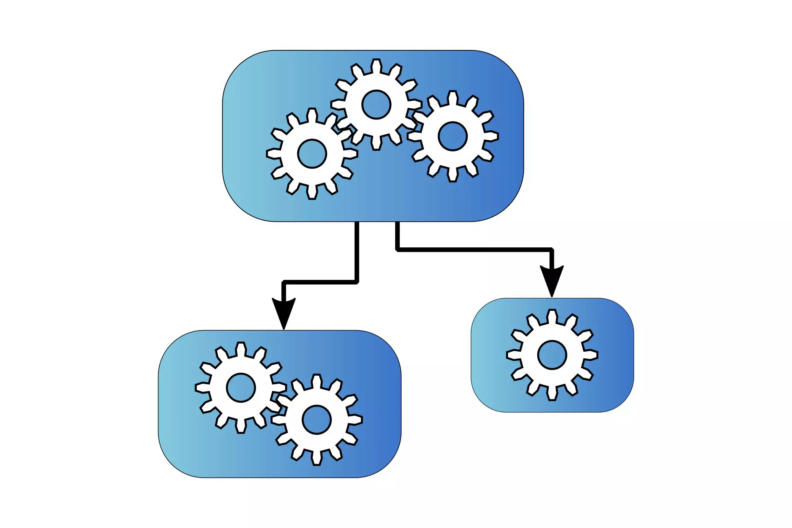

# Assembly Graph

The editor script creates GraphViz files that are either saved in your Assets folder or opened via https://quickchart.io/ in your default browser.

## Sample Results

- [Player Assemblies inside the demo](https://quickchart.io/graphviz?graph=digraph{%22asset-store-tools-editor%22[style=filled,fillcolor=gray];%22LocalStorage%22;%22FakeBackend%22;%22AppLayer%22;%22AssemblyGraphEditor%22[style=filled,fillcolor=gray];%22SaveSystem%22;%22RemoteStorage%22;%22AppLayer%22-%3E%22FakeBackend%22;%22AppLayer%22-%3E%22LocalStorage%22;%22AppLayer%22-%3E%22SaveSystem%22;%22AppLayer%22-%3E%22RemoteStorage%22;}) (Unity assemblies excluded)
- [Player and Editor Assemblies inside the demo](https://quickchart.io/graphviz?graph=digraph{%22Unity.Timeline%22;%22Unity.Timeline.Editor%22[style=filled,fillcolor=gray];%22Unity.TextMeshPro.Editor%22[style=filled,fillcolor=gray];%22Unity.VisualScripting.Flow%22;%22asset-store-tools-editor%22[style=filled,fillcolor=gray];%22UnityEditor.UI%22[style=filled,fillcolor=gray];%22Unity.PlasticSCM.Editor%22[style=filled,fillcolor=gray];%22Unity.VisualScripting.Core%22;%22Unity.VisualScripting.Core.Editor%22[style=filled,fillcolor=gray];%22Unity.VisualScripting.Flow.Editor%22[style=filled,fillcolor=gray];%22UnityEditor.TestRunner%22[style=filled,fillcolor=gray];%22Unity.VisualScripting.SettingsProvider.Editor%22[style=filled,fillcolor=gray];%22UnityEngine.TestRunner%22;%22UnityEngine.UI%22;%22Unity.VisualStudio.Editor%22[style=filled,fillcolor=gray];%22Unity.TestTools.CodeCoverage.Editor.OpenCover.Model%22[style=filled,fillcolor=gray];%22Unity.Rider.Editor%22[style=filled,fillcolor=gray];%22LocalStorage%22;%22Unity.VisualScripting.State.Editor%22[style=filled,fillcolor=gray];%22Unity.TestTools.CodeCoverage.Editor%22[style=filled,fillcolor=gray];%22FakeBackend%22;%22AppLayer%22;%22Unity.VisualScripting.State%22;%22Unity.TextMeshPro%22;%22Unity.Performance.Profile-Analyzer.Editor%22[style=filled,fillcolor=gray];%22Unity.VSCode.Editor%22[style=filled,fillcolor=gray];%22Unity.TestTools.CodeCoverage.Editor.OpenCover.Mono.Reflection%22[style=filled,fillcolor=gray];%22Unity.Settings.Editor%22[style=filled,fillcolor=gray];%22AssemblyGraphEditor%22[style=filled,fillcolor=gray];%22SaveSystem%22;%22Unity.EditorCoroutines.Editor%22[style=filled,fillcolor=gray];%22RemoteStorage%22;%22Unity.VisualScripting.Shared.Editor%22[style=filled,fillcolor=gray];%22Unity.CollabProxy.Editor%22[style=filled,fillcolor=gray];%22Unity.Timeline%22-%3E%22UnityEditor.UI%22;%22Unity.Timeline%22-%3E%22UnityEngine.UI%22;%22Unity.Timeline.Editor%22-%3E%22Unity.Timeline%22;%22Unity.Timeline.Editor%22-%3E%22UnityEditor.UI%22;%22Unity.Timeline.Editor%22-%3E%22UnityEngine.UI%22;%22Unity.Timeline.Editor%22-%3E%22UnityEditor.TestRunner%22;%22Unity.Timeline.Editor%22-%3E%22UnityEngine.TestRunner%22;%22Unity.TextMeshPro.Editor%22-%3E%22Unity.TextMeshPro%22;%22Unity.TextMeshPro.Editor%22-%3E%22UnityEditor.UI%22;%22Unity.TextMeshPro.Editor%22-%3E%22UnityEngine.UI%22;%22Unity.TextMeshPro.Editor%22-%3E%22UnityEditor.TestRunner%22;%22Unity.TextMeshPro.Editor%22-%3E%22UnityEngine.TestRunner%22;%22Unity.VisualScripting.Flow%22-%3E%22Unity.VisualScripting.Core%22;%22Unity.VisualScripting.Flow%22-%3E%22UnityEditor.UI%22;%22Unity.VisualScripting.Flow%22-%3E%22UnityEngine.UI%22;%22asset-store-tools-editor%22-%3E%22UnityEditor.UI%22;%22asset-store-tools-editor%22-%3E%22UnityEngine.UI%22;%22asset-store-tools-editor%22-%3E%22UnityEditor.TestRunner%22;%22asset-store-tools-editor%22-%3E%22UnityEngine.TestRunner%22;%22UnityEditor.UI%22-%3E%22UnityEngine.UI%22;%22UnityEditor.UI%22-%3E%22UnityEditor.TestRunner%22;%22UnityEditor.UI%22-%3E%22UnityEngine.TestRunner%22;%22Unity.PlasticSCM.Editor%22-%3E%22UnityEditor.UI%22;%22Unity.PlasticSCM.Editor%22-%3E%22UnityEngine.UI%22;%22Unity.PlasticSCM.Editor%22-%3E%22UnityEditor.TestRunner%22;%22Unity.PlasticSCM.Editor%22-%3E%22UnityEngine.TestRunner%22;%22Unity.VisualScripting.Core%22-%3E%22UnityEditor.UI%22;%22Unity.VisualScripting.Core%22-%3E%22UnityEngine.UI%22;%22Unity.VisualScripting.Core.Editor%22-%3E%22Unity.VisualScripting.Core%22;%22Unity.VisualScripting.Core.Editor%22-%3E%22UnityEditor.UI%22;%22Unity.VisualScripting.Core.Editor%22-%3E%22UnityEngine.UI%22;%22Unity.VisualScripting.Core.Editor%22-%3E%22UnityEditor.TestRunner%22;%22Unity.VisualScripting.Core.Editor%22-%3E%22UnityEngine.TestRunner%22;%22Unity.VisualScripting.Flow.Editor%22-%3E%22Unity.VisualScripting.Core%22;%22Unity.VisualScripting.Flow.Editor%22-%3E%22Unity.VisualScripting.Core.Editor%22;%22Unity.VisualScripting.Flow.Editor%22-%3E%22Unity.VisualScripting.Flow%22;%22Unity.VisualScripting.Flow.Editor%22-%3E%22UnityEditor.UI%22;%22Unity.VisualScripting.Flow.Editor%22-%3E%22UnityEngine.UI%22;%22Unity.VisualScripting.Flow.Editor%22-%3E%22UnityEditor.TestRunner%22;%22Unity.VisualScripting.Flow.Editor%22-%3E%22UnityEngine.TestRunner%22;%22UnityEditor.TestRunner%22-%3E%22UnityEngine.TestRunner%22;%22Unity.VisualScripting.SettingsProvider.Editor%22-%3E%22Unity.VisualScripting.Core%22;%22Unity.VisualScripting.SettingsProvider.Editor%22-%3E%22Unity.VisualScripting.Core.Editor%22;%22Unity.VisualScripting.SettingsProvider.Editor%22-%3E%22Unity.VisualScripting.Flow%22;%22Unity.VisualScripting.SettingsProvider.Editor%22-%3E%22Unity.VisualScripting.Flow.Editor%22;%22Unity.VisualScripting.SettingsProvider.Editor%22-%3E%22Unity.VisualScripting.State%22;%22Unity.VisualScripting.SettingsProvider.Editor%22-%3E%22UnityEditor.UI%22;%22Unity.VisualScripting.SettingsProvider.Editor%22-%3E%22UnityEngine.UI%22;%22Unity.VisualScripting.SettingsProvider.Editor%22-%3E%22UnityEditor.TestRunner%22;%22Unity.VisualScripting.SettingsProvider.Editor%22-%3E%22UnityEngine.TestRunner%22;%22Unity.VisualStudio.Editor%22-%3E%22UnityEditor.UI%22;%22Unity.VisualStudio.Editor%22-%3E%22UnityEngine.UI%22;%22Unity.VisualStudio.Editor%22-%3E%22UnityEditor.TestRunner%22;%22Unity.VisualStudio.Editor%22-%3E%22UnityEngine.TestRunner%22;%22Unity.TestTools.CodeCoverage.Editor.OpenCover.Model%22-%3E%22UnityEditor.UI%22;%22Unity.TestTools.CodeCoverage.Editor.OpenCover.Model%22-%3E%22UnityEngine.UI%22;%22Unity.TestTools.CodeCoverage.Editor.OpenCover.Model%22-%3E%22UnityEditor.TestRunner%22;%22Unity.TestTools.CodeCoverage.Editor.OpenCover.Model%22-%3E%22UnityEngine.TestRunner%22;%22Unity.Rider.Editor%22-%3E%22UnityEditor.TestRunner%22;%22Unity.Rider.Editor%22-%3E%22UnityEngine.TestRunner%22;%22Unity.Rider.Editor%22-%3E%22UnityEditor.UI%22;%22Unity.Rider.Editor%22-%3E%22UnityEngine.UI%22;%22LocalStorage%22-%3E%22UnityEditor.UI%22;%22LocalStorage%22-%3E%22UnityEngine.UI%22;%22Unity.VisualScripting.State.Editor%22-%3E%22Unity.VisualScripting.Core%22;%22Unity.VisualScripting.State.Editor%22-%3E%22Unity.VisualScripting.Flow%22;%22Unity.VisualScripting.State.Editor%22-%3E%22Unity.VisualScripting.State%22;%22Unity.VisualScripting.State.Editor%22-%3E%22Unity.VisualScripting.Core.Editor%22;%22Unity.VisualScripting.State.Editor%22-%3E%22Unity.VisualScripting.Flow.Editor%22;%22Unity.VisualScripting.State.Editor%22-%3E%22UnityEditor.UI%22;%22Unity.VisualScripting.State.Editor%22-%3E%22UnityEngine.UI%22;%22Unity.VisualScripting.State.Editor%22-%3E%22UnityEditor.TestRunner%22;%22Unity.VisualScripting.State.Editor%22-%3E%22UnityEngine.TestRunner%22;%22Unity.TestTools.CodeCoverage.Editor%22-%3E%22UnityEngine.TestRunner%22;%22Unity.TestTools.CodeCoverage.Editor%22-%3E%22UnityEditor.TestRunner%22;%22Unity.TestTools.CodeCoverage.Editor%22-%3E%22Unity.TestTools.CodeCoverage.Editor.OpenCover.Model%22;%22Unity.TestTools.CodeCoverage.Editor%22-%3E%22Unity.TestTools.CodeCoverage.Editor.OpenCover.Mono.Reflection%22;%22Unity.TestTools.CodeCoverage.Editor%22-%3E%22Unity.Settings.Editor%22;%22Unity.TestTools.CodeCoverage.Editor%22-%3E%22UnityEditor.UI%22;%22Unity.TestTools.CodeCoverage.Editor%22-%3E%22UnityEngine.UI%22;%22FakeBackend%22-%3E%22UnityEditor.UI%22;%22FakeBackend%22-%3E%22UnityEngine.UI%22;%22AppLayer%22-%3E%22FakeBackend%22;%22AppLayer%22-%3E%22LocalStorage%22;%22AppLayer%22-%3E%22SaveSystem%22;%22AppLayer%22-%3E%22RemoteStorage%22;%22AppLayer%22-%3E%22UnityEditor.UI%22;%22AppLayer%22-%3E%22UnityEngine.UI%22;%22Unity.VisualScripting.State%22-%3E%22Unity.VisualScripting.Core%22;%22Unity.VisualScripting.State%22-%3E%22Unity.VisualScripting.Flow%22;%22Unity.VisualScripting.State%22-%3E%22UnityEditor.UI%22;%22Unity.VisualScripting.State%22-%3E%22UnityEngine.UI%22;%22Unity.TextMeshPro%22-%3E%22UnityEditor.UI%22;%22Unity.TextMeshPro%22-%3E%22UnityEngine.UI%22;%22Unity.Performance.Profile-Analyzer.Editor%22-%3E%22UnityEditor.UI%22;%22Unity.Performance.Profile-Analyzer.Editor%22-%3E%22UnityEngine.UI%22;%22Unity.Performance.Profile-Analyzer.Editor%22-%3E%22UnityEditor.TestRunner%22;%22Unity.Performance.Profile-Analyzer.Editor%22-%3E%22UnityEngine.TestRunner%22;%22Unity.VSCode.Editor%22-%3E%22UnityEditor.UI%22;%22Unity.VSCode.Editor%22-%3E%22UnityEngine.UI%22;%22Unity.VSCode.Editor%22-%3E%22UnityEditor.TestRunner%22;%22Unity.VSCode.Editor%22-%3E%22UnityEngine.TestRunner%22;%22Unity.TestTools.CodeCoverage.Editor.OpenCover.Mono.Reflection%22-%3E%22UnityEditor.UI%22;%22Unity.TestTools.CodeCoverage.Editor.OpenCover.Mono.Reflection%22-%3E%22UnityEngine.UI%22;%22Unity.TestTools.CodeCoverage.Editor.OpenCover.Mono.Reflection%22-%3E%22UnityEditor.TestRunner%22;%22Unity.TestTools.CodeCoverage.Editor.OpenCover.Mono.Reflection%22-%3E%22UnityEngine.TestRunner%22;%22Unity.Settings.Editor%22-%3E%22UnityEditor.UI%22;%22Unity.Settings.Editor%22-%3E%22UnityEngine.UI%22;%22Unity.Settings.Editor%22-%3E%22UnityEditor.TestRunner%22;%22Unity.Settings.Editor%22-%3E%22UnityEngine.TestRunner%22;%22AssemblyGraphEditor%22-%3E%22UnityEditor.UI%22;%22AssemblyGraphEditor%22-%3E%22UnityEngine.UI%22;%22AssemblyGraphEditor%22-%3E%22UnityEditor.TestRunner%22;%22AssemblyGraphEditor%22-%3E%22UnityEngine.TestRunner%22;%22SaveSystem%22-%3E%22UnityEditor.UI%22;%22SaveSystem%22-%3E%22UnityEngine.UI%22;%22Unity.EditorCoroutines.Editor%22-%3E%22UnityEditor.UI%22;%22Unity.EditorCoroutines.Editor%22-%3E%22UnityEngine.UI%22;%22Unity.EditorCoroutines.Editor%22-%3E%22UnityEditor.TestRunner%22;%22Unity.EditorCoroutines.Editor%22-%3E%22UnityEngine.TestRunner%22;%22RemoteStorage%22-%3E%22UnityEditor.UI%22;%22RemoteStorage%22-%3E%22UnityEngine.UI%22;%22Unity.VisualScripting.Shared.Editor%22-%3E%22Unity.VisualScripting.Core.Editor%22;%22Unity.VisualScripting.Shared.Editor%22-%3E%22Unity.VisualScripting.Flow.Editor%22;%22Unity.VisualScripting.Shared.Editor%22-%3E%22Unity.VisualScripting.State.Editor%22;%22Unity.VisualScripting.Shared.Editor%22-%3E%22Unity.VisualScripting.Core%22;%22Unity.VisualScripting.Shared.Editor%22-%3E%22Unity.VisualScripting.Flow%22;%22Unity.VisualScripting.Shared.Editor%22-%3E%22Unity.VisualScripting.State%22;%22Unity.VisualScripting.Shared.Editor%22-%3E%22UnityEditor.UI%22;%22Unity.VisualScripting.Shared.Editor%22-%3E%22UnityEngine.UI%22;%22Unity.VisualScripting.Shared.Editor%22-%3E%22UnityEditor.TestRunner%22;%22Unity.VisualScripting.Shared.Editor%22-%3E%22UnityEngine.TestRunner%22;%22Unity.CollabProxy.Editor%22-%3E%22Unity.PlasticSCM.Editor%22;%22Unity.CollabProxy.Editor%22-%3E%22UnityEditor.UI%22;%22Unity.CollabProxy.Editor%22-%3E%22UnityEngine.UI%22;%22Unity.CollabProxy.Editor%22-%3E%22UnityEditor.TestRunner%22;%22Unity.CollabProxy.Editor%22-%3E%22UnityEngine.TestRunner%22;}) (Unity assemblies included)

## HowTo

see [Assets/README.md](Assets/README.md)

## Background Info

- The tool was developed as part of a scientific paper describing a method for minimizing dependencies between Unity assemblies. Among other things, the use of the Object Adapter pattern is examined there. Some sample scripts can be found in an optional folder.

- It was planned to upload the Unity project to the Unity Asset Store. Due to the slow approval process, it has not yet been published there.

- The scientific paper has not yet been published, so please be patient. It was written in German and has not yet been translated into English.
